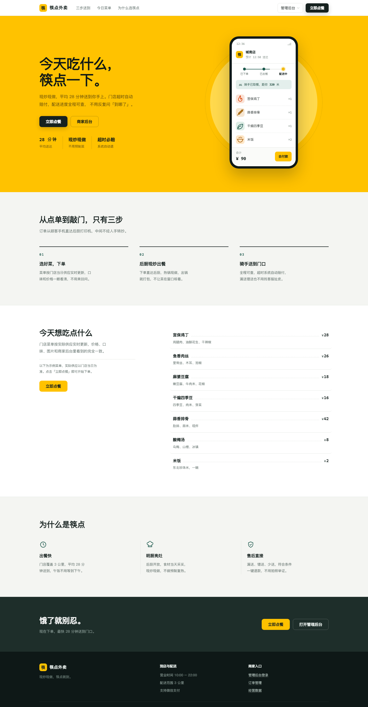
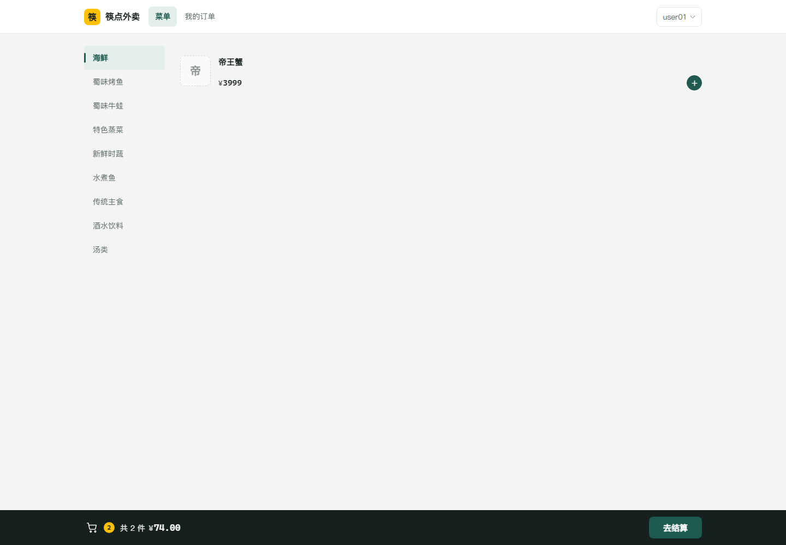
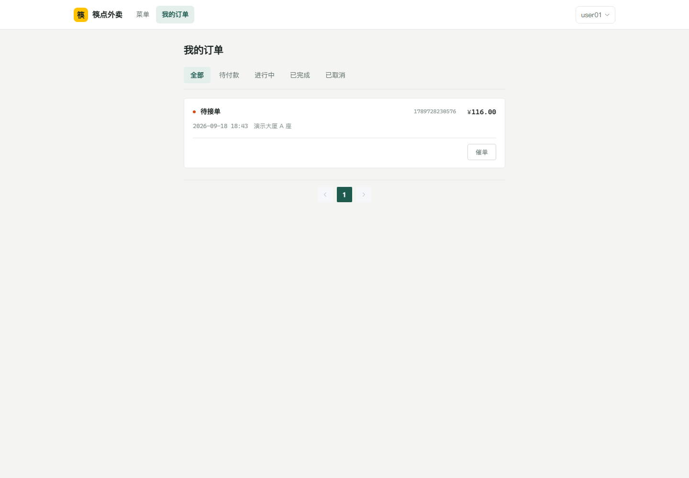
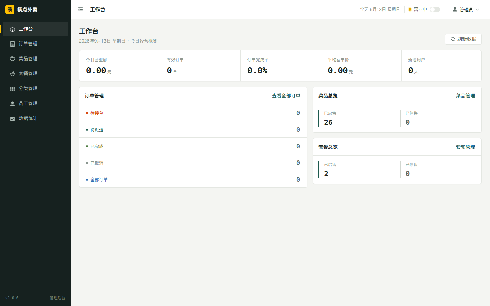
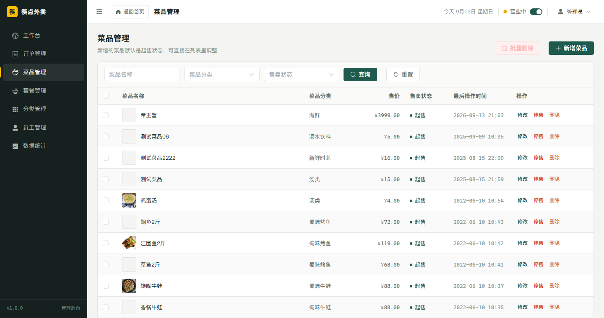
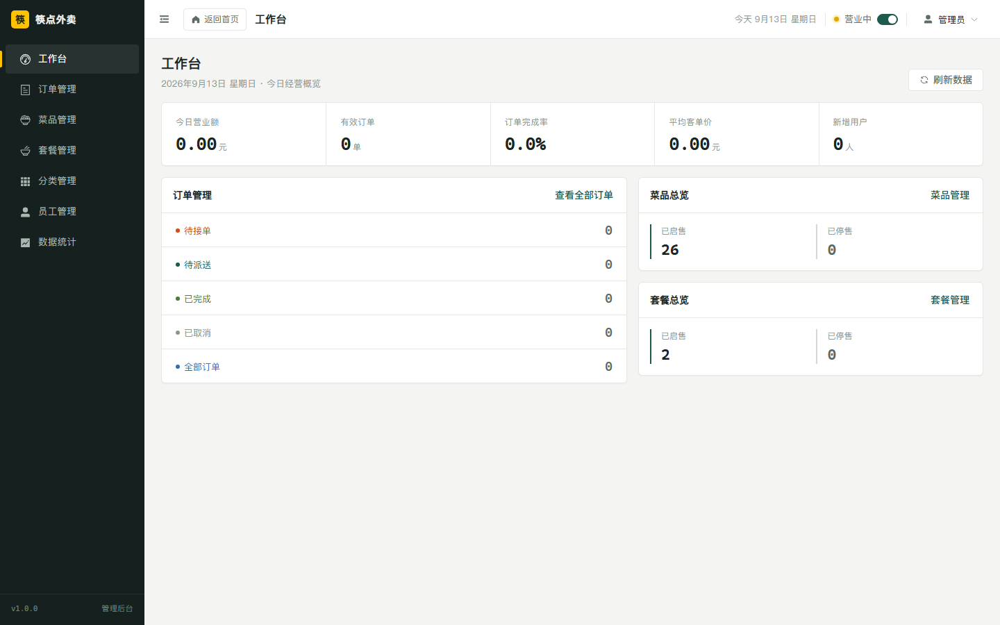

# 筷点外卖 · 后端（Spring Boot + MyBatis）

一个外卖平台的服务端，源码基于黑马程序员《苍穹外卖》课程项目。文案统一改成了
「筷点外卖」，代码结构、包名 `com.sky`、数据库名 `sky_take_out` 保持原样。

在原课程的基础上做了两块扩展：

- **补齐了优惠券**：原课程的券只有「名称 + 库存」，不能当钱用。现在加了面额和使用门槛，
  用户端多了**领券中心**（可抢的券 / 我的券）和**优惠券秒杀**（Redis + Lua 扣库存防超卖），
  提交订单时可以选用一张抵扣；管理端多了券的增删改查和上下架。
- **加了一套网页端**：营销首页 + 顾客点餐端 + 商家后台，都在同仓库的 `web/` 里。
  为此补了账号密码登录、注册、重置密码三个接口，并修了几处订单、购物车相关的缺陷（见「五、已知限制」）。

> 前端代码在**同一个仓库**的 [`web/`](web/) 目录（Vue 3 + Vite + Element Plus，
> 含营销首页、顾客点餐端和商家管理后台）。

### 仓库结构

| 目录 / 文件 | 内容 |
| --- | --- |
| `sky-common/`、`sky-pojo/`、`sky-server/` | 后端 Maven 三模块 |
| `docs/sky_take_out.sql` | 演示数据库快照（个人信息已全部脱敏） |
| `web/` | 前端工程（Vue 3 + Vite + Element Plus），有独立 README |

---

## 界面预览

**营销首页**（公开页面，纯 CSS + 内联 SVG 实现，不依赖任何图片文件）



**顾客点餐端**（挂在 `/order` 下，顾客登录后才能进）

| 点餐 | 我的订单 |
| :---: | :---: |
|  |  |

**商家管理后台**（统一挂在 `/manage` 下，含工作台、订单、菜品、套餐、分类、优惠券、员工、数据统计八个模块）

| 工作台 | 菜品管理 |
| :---: | :---: |
|  |  |

后台每页顶栏左侧与侧边栏品牌区都能一键回首页：



> 前端的启动步骤、接口对接约定与设计说明见 [`web/README.md`](web/README.md)。

---

## 一、技术栈

| 分类 | 选型 |
| --- | --- |
| 框架 | Spring Boot 2.7.3、Spring MVC、Spring AOP |
| 持久层 | MyBatis 2.2.0（XML 映射）、PageHelper 1.3.0、Druid 1.2.1 |
| 数据库 | MySQL 8.0 |
| 缓存 | Redis（存放店铺营业状态；优惠券秒杀的库存扣减走 Lua 脚本，保证不超卖） |
| 鉴权 | JWT（jjwt 0.9.1），分管理端 / 用户端两套 token |
| 实时通信 | WebSocket（来单提醒、催单） |
| 接口文档 | Knife4j 3.0.2（Swagger 增强） |
| 其它 | Lombok、FastJSON、Apache POI 3.16 |
| 构建 | Maven 多模块，JDK 1.8+ |

### 模块划分

```
sky-take-out
├── sky-common    # 常量、上下文、工具类、异常、公共返回结构 Result / PageResult
├── sky-pojo      # Entity / DTO / VO
└── sky-server    # 启动类、Controller、Service、Mapper、配置、拦截器、WebSocket、定时任务
```

---

## 二、环境要求

| 依赖 | 版本 / 说明 |
| --- | --- |
| JDK | 1.8 及以上 |
| Maven | 3.6+ |
| MySQL | 8.0（端口 3306） |
| Redis | 5.0+（端口 6379） |

---

## 三、快速开始

### 1. 建库并导入演示数据

仓库自带一份可跑的演示数据库快照：`docs/sky_take_out.sql`

```bash
mysql -uroot -p --default-character-set=utf8mb4 < docs/sky_take_out.sql
```

脚本里带了 `DROP DATABASE IF EXISTS sky_take_out`，**会覆盖同名库**，本机已有同名库时注意先备份。

> 这份快照里的顾客姓名、手机号、身份证号、收货地址、微信 openid 已全部替换为虚构演示数据
> （如 `演示顾客` / `13800000001` / `演示大厦 A 座`），不含任何真实个人信息。
> 演示登录账号：商家后台 **admin / 123456**，网页点餐端 **user01 / 123456**
> （另有 user02、user03，密码相同）。

### 2. 生成本地配置

`application-dev.yml` 含数据库密码与云服务密钥，**不在仓库里**，需要从模板复制：

```bash
cd sky-server/src/main/resources
cp application-dev.yml.example application-dev.yml
```

然后按自己的环境改这几项：

```yaml
sky:
  datasource:
    username: root
    password: 你的MySQL密码
  redis:
    password: 你的Redis密码
```

阿里云 OSS（`sky.alioss.*`）与微信小程序（`sky.wechat.*`）**先留占位值也能跑**，
只影响这两块功能，不影响其它功能。

图片上传用的是本机磁盘，不依赖云服务，配置项在 `sky.upload`：

```yaml
sky:
  upload:
    dir: upload       # 落盘目录，相对路径按后端进程的工作目录解析
    url-prefix: /images
```

上传的文件会写到 `sky-server/upload/`，通过 `/images/xxx` 访问。前端 dev server 的
`vite.config.js` 里已经把 `/images` 代理到后端，所以本地开发直接就能看到图。

### 3. 启动 Redis

店铺营业状态存在 Redis 里，**Redis 没起来时 `/admin/shop/status` 会直接返回 500**。

```bash
redis-server
```

### 4. 启动后端

IDE 里直接运行 `sky-server` 模块的启动类 `com.sky.SkyApplication`，或者：

```bash
mvn clean package -DskipTests
java -jar sky-server/target/sky-server-1.0-SNAPSHOT.jar
```

服务默认跑在 **8080**。

### 5. 打开接口文档

```
http://localhost:8080/doc.html
```

Knife4j 能正常打开，就说明后端和数据库都通了。

---

## 四、接口约定（对接前端时最容易踩的几个点）

1. **返回结构用 `code` 而不是 HTTP 状态码**

   ```json
   { "code": 1, "msg": null, "data": { } }
   ```

   `code: 1` 成功，`code: 0` 及其它为失败，HTTP 状态码基本都是 200。

2. **鉴权失败返回 HTTP 401**，由 `JwtTokenAdminInterceptor` / `JwtTokenUserInterceptor` 直接 `setStatus(401)`。

3. **两套请求头**：管理端 `/admin/**` 用 `token`，用户端 `/user/**` 用 `authentication`。

4. **分页返回 `PageResult { total, records }`**，不是 `{ total, rows }`。

5. **时间序列化不带秒**：`JacksonObjectMapper` 把 `LocalDateTime` 输出成 `yyyy-MM-dd HH:mm`；
   但查询参数走 `@DateTimeFormat`，订单搜索的 `beginTime / endTime` 要 `yyyy-MM-dd HH:mm:ss`。

6. **删除接口参数名不统一**：菜品是 `@RequestParam List<Long> ids`，套餐是 `@RequestParam List<Long> id`，
   都接收 `1,2,3` 逗号串。

7. **状态由 Service 写死**：新增菜品强制**起售**（`DishServiceImpl.saveWithFlavor`），
   新增套餐强制**停售**（`SetMealServiceImpl.save`），需手动起售。

8. **没有配置 CORS**：`WebMvcConfiguration` 里没有 `addCorsMappings`，
   跨域需要前端用 Vite / Nginx 代理解决。

9. **报表接口返回逗号分隔字符串**，不是数组：

   ```json
   { "dateList": "2026-09-01,2026-09-02", "turnoverList": "406.0,1520.0" }
   ```

10. **WebSocket 地址是 `/ws/{sid}`**，会推两种消息：**`type:1` 是新订单提醒**（在 `paySuccess` 里发）、
    **`type:2` 是顾客催单**（在 `reminder` 里发），格式都是 `{"type":..,"orderId":..,"content":"订单号：.."}`。

---

## 五、已知限制

- **菜品图片已改为本地**：库里 `dish.image` 原本指向黑马官方的教学 OSS bucket
  （`sky-itcast.oss-cn-beijing.aliyuncs.com`），该 bucket 权限已被收回，现在返回 **403**。
  现已换成 `web/public/dishes/` 下的本地图片，用相对路径 `/dishes/xxx.webp` 访问。
- **图片上传也落在本机磁盘**：原课程走阿里云 OSS，AccessKey 一旦过期/欠费/被禁用，
  `AliOssUtil.upload()` 会**吞掉异常并把 URL 照常返回**，表现为「上传成功但图片加载失败」。
  现已改成写入 `sky-server/upload/`，由 `/images/**` 静态映射对外提供，不再依赖云服务。
- **支付是模拟的**：`OrderServiceImpl.payment` 里调微信支付那段被注释掉了，接口直接返回成功
  并把订单置为「待接单 + 已支付」。所以网页点餐端能跑通完整下单流程，但**没有真实收银**。
- **微信登录在原环境下仍然跑不通**（`/user/user/login` 要真实小程序的 `code` 去换 openid），
  所以另外加了 `/user/user/loginByPassword` 账号密码登录给网页点餐端用，原接口保留未动。
- 支付回调 `PayNotifyController` 需要外部可达的回调地址，本地只能靠接口文档查看结构。

### 与原版课程的差异

除了文案改名，为配合仓库里的网页点餐端，后端还动了这几处：

| 位置 | 改动 |
| --- | --- |
| `user` 表 | 加 `username` / `password` 两列并给 `username` 建唯一索引，预置 user01~03 三个演示账号（各带一条收货地址） |
| `UserController` | 新增 `POST /user/user/loginByPassword`（登录）、`/register`（注册）、`/resetPassword`（重置密码） |
| `OrderServiceImpl.payment` | 原来直接改库、绕过了 `paySuccess`，导致来单提醒推不出去；改为调 `paySuccess` |
| `OrderServiceImpl.submitOrder` | 清购物车误用了按主键删除的 `delete(userId)`，改回按用户清空的 `clean(userId)` |
| `OrderMapper.xml` 的 `update` | `<set>` 里缺 `pay_status` / `pay_method` / `checkout_time`，支付状态更新不上，已补齐 |
| `OrderServiceImpl` 的 `cancel` / `rejection` / `userCancelById` | 已支付订单退款时调 `weChatPayUtil.refund`，而本机没有微信支付商户证书（`WeChatPayUtil.getClient` 里 `new File(null)` 直接抛 `NullPointerException`），导致拒单、取消订单一律返回 **500**。改为跳过真实退款、只把支付状态置为「已退款」 |
| `voucher` / `voucher_order` / `orders` 三张表 | 原课程的优惠券只有「名称 + 库存」，没有面额，没法当钱抵扣。给 `voucher` 加 `value`（抵扣金额）、`min_amount`（使用门槛）、`status`（上下架）；`voucher_order` 加 `status`（0 未使用 / 1 已使用）、`used_time`、`order_id`；`orders` 加 `voucher_id`、`voucher_amount` |
| `VoucherServiceImpl` 的秒杀 Lua 脚本 | 库存 key 不存在时，原来只把初始库存赋给了 Lua 局部变量、没写回 Redis，紧接着的 `decr` 就作用在一个不存在的 key 上（Redis 视作 0），库存直接变成 **-1** → **只有第一个用户能抢到，之后所有人都提示「已抢完」**。改为先 `exists` 判断、不存在则 `set` 回初始值 |
| `VoucherController`（用户端 `/user/voucher`、管理端 `/admin/voucher`） | 原来只有 `POST /user/voucher/seckill/{id}` 一个接口。用户端补上「可抢的券」`/list` 与「我的券」`/my`；管理端新增券的分页查询、新增、修改、删除、上下架 |
| `OrderServiceImpl.submitOrder` | 支持用券下单：校验券归属→是否已用→是否过期→订单原价是否够门槛，然后抵扣并把券核销，全程与订单落库同一事务。抵扣金额由后端按原价算，不采信前端传来的实付金额 |
| `AliOssUtil` → `LocalFileUtil`（sky-common） | 上传改走本机磁盘。原来 `upload()` 的 `catch` 只 `println` 不 `rethrow`，OSS 出任何错（AccessKey 被禁用、bucket 权限不对、区域不匹配）都会被吞掉、照样返回一个 URL，前端拿到「格式正确但打不开」的地址，表现为「上传成功但图片加载失败」。换成写本地文件后异常能正常冒泡成 `code:0` |
| `CommonController.upload` | 改用 `LocalFileUtil`，返回 `/images/xxx` 相对地址 |
| `WebMvcConfiguration.addResourceHandlers` | 增加 `/images/**` → 本地上传目录的静态资源映射 |
| `dish` 表的 `image` | 21 条指向已失效 OSS 的记录改为本地相对路径 `/dishes/xxx.webp`，图片放在 `web/public/dishes/`（原失效值备份在 `dish_image_backup` 表） |
| `ShoppingCartServiceImpl.subShoppingCart` | 减菜数量时直接 `list.get(0)`，商品不在购物车里就会抛 `IndexOutOfBoundsException` 返回 **500**（两个标签页各点一次减号就能复现）。加了空集合判断 |
| `ShoppingCartMapper.insertBatch` | 接口有方法、XML 里没有对应语句，「再来一单」调 `/user/order/repetition/{id}` 会报 `Invalid bound statement (not found)` → **500**。补上了批量插入 |
| `OrderServiceImpl.submitOrder` 的金额 | 原来直接拿请求体里的 `amount` 入库：不传就撞 `orders.amount` 的 not null、接口报「未知错误」；传假数就能一块钱下单。改为**按购物车单价 × 数量在后端算**，请求体里的金额一律不看（券的门槛校验也随之改用算出来的原价） |
| `Orders` 实体 | `packAmount` / `tablewareNumber` 由基本类型 `int` 改为 `Integer`。DTO 里是 `Integer`，请求不传这两个字段时 `BeanUtils.copyProperties` 拆箱会抛 NPE。同时在 `submitOrder` 里给 `packAmount`、`tablewareNumber`、`deliveryStatus`、`tablewareStatus` 补了默认值，因为这几列在库里都是 not null |
| `GlobalExceptionHandler` | 原来只处理 `BaseException` 和 `SQLIntegrityConstraintViolationException`（且后者非重名分支不打堆栈）。补了 `Exception` 兜底并输出完整堆栈，否则后端出任何别的异常都只能看到一句「未知错误」，排查不了 |

---

## 六、免责声明

本项目是**学习用途**的课程练手项目，不是生产可用的系统：

- 演示数据为虚构，不含真实个人信息。
- 仓库中不含任何真实的数据库密码、云服务密钥或小程序密钥（真实配置走
  `application-dev.yml`，已被 `.gitignore` 排除）。
- 如用于自己的环境，请自行替换全部密钥并评估安全性。
