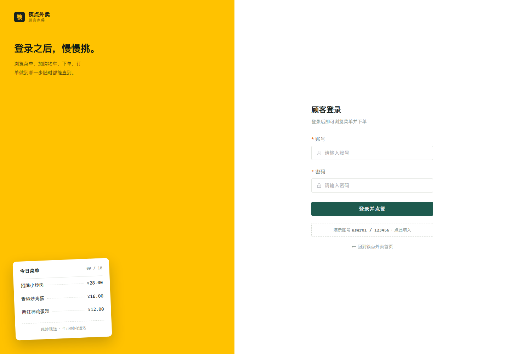
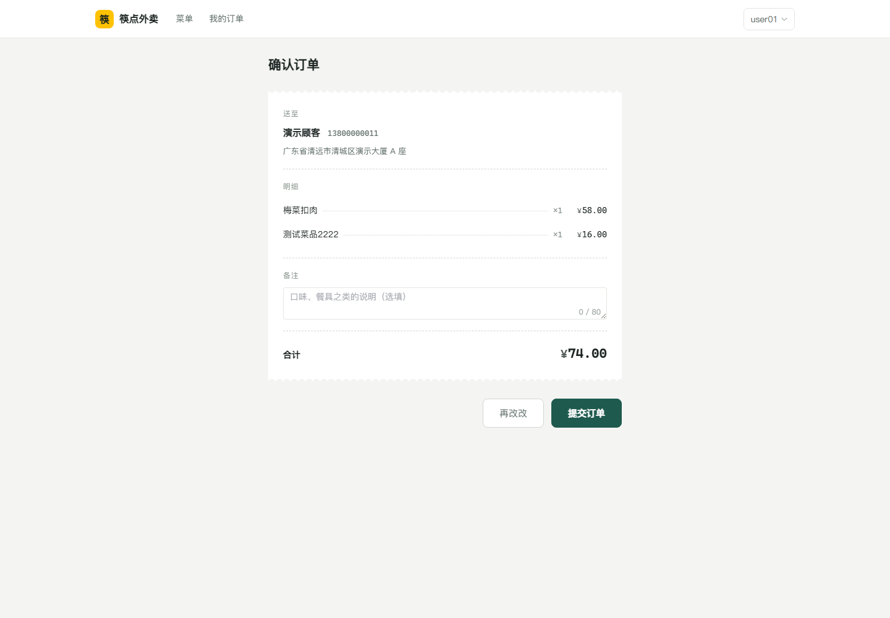
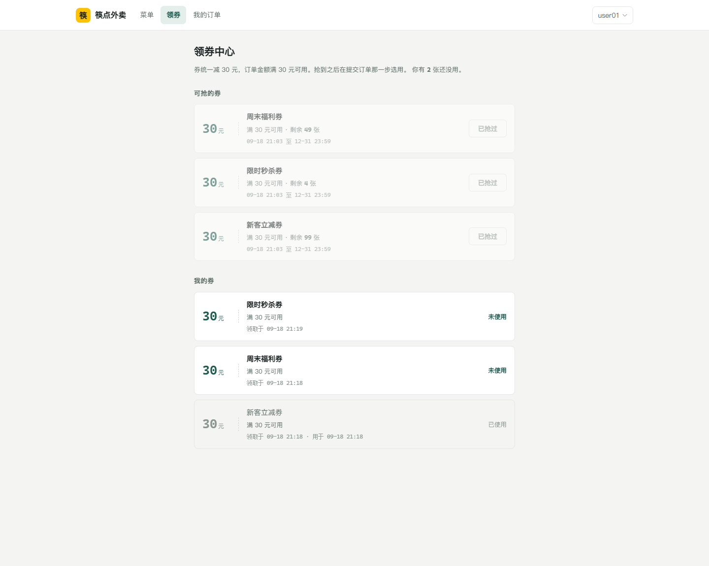
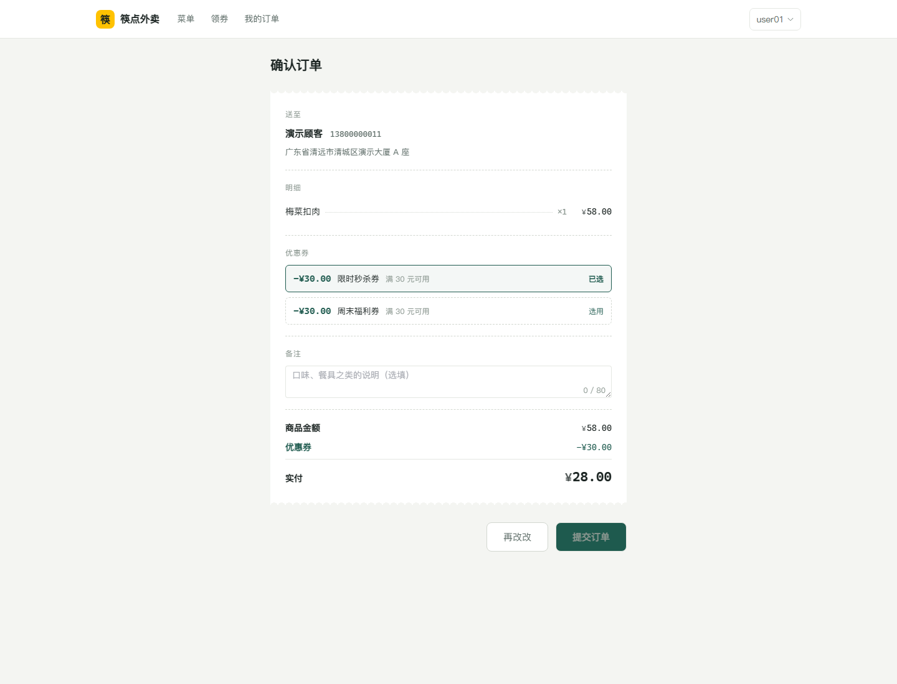
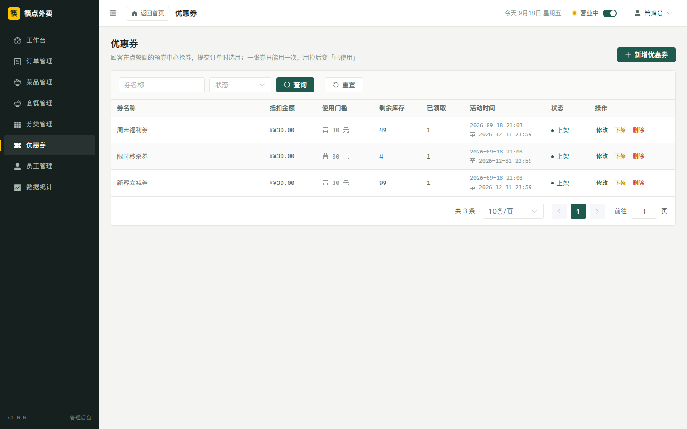

# 筷点外卖 · 前端（营销首页 + 顾客点餐端 + 商家管理后台）

配套后端：**本仓库根目录**（Spring Boot + MyBatis + MySQL + Redis + WebSocket）

技术栈：**Vue 3 + Vite + Element Plus + Pinia + Vue Router + Axios + ECharts**

---

## 界面预览

**营销首页**（公开页面，纯 CSS + 内联 SVG 实现，不依赖任何图片文件）


**顾客点餐端**（挂在 `/order` 下，顾客登录后才能进）

| 顾客登录 | 点餐 |
| :---: | :---: |
|  |  |

| 确认订单 | 我的订单 |
| :---: | :---: |
|  |  |

**优惠券**（顾客在领券中心抢券，提交订单时选用，一单限一张；没抢到券的话结算页不会出现这一块）

| 领券中心 | 提交订单时选用 |
| :---: | :---: |
|  |  |

**商家管理后台**（统一挂在 `/manage` 下，含工作台、订单、菜品、套餐、分类、优惠券、员工、数据统计）

| 工作台 | 菜品管理 |
| :---: | :---: |
|  |  |

| 优惠券管理 |
| :---: |
|  |

后台每页顶栏左侧与侧边栏品牌区都能一键回首页：


---

## 一、快速开始

### 1. 先启动后端

前端所有请求都代理到 `http://localhost:8080`，所以后端必须先跑起来，且依赖以下服务：

| 服务 | 地址 | 说明 |
| --- | --- | --- |
| MySQL | `localhost:3306` | 库名 `sky_take_out`，账号 `root / 123456` |
| Redis | `localhost:6379` | 密码 `123456`，`database: 10` |
| 后端 | `localhost:8080` | 启动 `sky-server` 模块的启动类 |

之后可以访问 `http://localhost:8080/doc.html` 确认 Knife4j 接口文档能打开。

### 2. 启动前端

```bash
cd web
npm install
npm run dev
```

浏览器打开终端里输出的地址（默认 `http://127.0.0.1:5173`）。

打开后先看到的是**营销首页**，纯 CSS + 内联 SVG 画的，不依赖任何图片文件。
首页顶栏放了两个入口：

- **立即点餐** → 进顾客点餐端，需要顾客登录（演示账号 `user01` / `123456`）
- **管理后台** → 下拉直接进后台各模块，需要员工登录（`admin` / `123456`）

两边各认各的登录态：拿顾客账号是进不去商家后台的，反过来也一样。

| 入口 | 地址 | 账号 |
| --- | --- | --- |
| 营销首页 | `http://127.0.0.1:5173/#/` | 无需登录 |
| 顾客登录 | `http://127.0.0.1:5173/#/order/login` | `user01` / `123456` |
| 顾客点餐 | `http://127.0.0.1:5173/#/order` | 需先登录 |
| 顾客订单 | `http://127.0.0.1:5173/#/order/orders` | 需先登录 |
| 员工登录 | `http://127.0.0.1:5173/#/login` | `admin` / `123456` |
| 商家后台 | `http://127.0.0.1:5173/#/manage/dashboard` | 需先登录 |

### 3. 打包

```bash
npm run build     # 产物在 dist/
npm run preview   # 本地预览打包结果
```

---

## 二、和后端的对接约定（踩过的坑都在这）

这个后端有几处和常见写法不一样的地方，前端都做了对应处理，改代码前建议先看一眼：

### 1. 统一返回结构不是 HTTP 状态码

后端的 `Result` 约定是 **`code: 1` 成功、`code: 0` 及其它失败**，HTTP 状态码基本都是 200。

```json
{ "code": 1, "msg": null, "data": { ... } }
```

`src/api/request.js` 的响应拦截器统一判断 `code === 1`，成功时直接把 `data` 返回给页面，失败时弹 `msg` 并 reject。

### 2. 401 是登录态失效

两端的拦截器校验失败时都返回 **HTTP 401**（不是 `code: 0`）。`request.js` 按请求来源分开处理：管理端的 401 清掉 `sky_admin_*` 并跳 `#/login`，顾客端的 401 清掉 `sky_user_*` 并跳 `#/order/login`。

### 3. 两套 token，请求头名字不一样

- 管理端（`/admin/**`）用请求头 **`token`**
- 顾客端（`/user/**`）用请求头 **`authentication`**

`src/api/request.js` 按 URL 前缀自动挑对应的那个，业务代码里不用管。

两边用的是**两套不同的签名密钥**（配在 `application.yml` 的 `sky.jwt.*` 下），
所以顾客的令牌拿去调 `/admin/**` 必然验签失败 —— **顾客进不了商家后台是后端保证的**，前端路由守卫只是顺手再拦一道。

### 4. 时间格式不带秒

`JacksonObjectMapper` 把 `LocalDateTime` 序列化成 **`yyyy-MM-dd HH:mm`**（注意：没有秒）。前端 `utils/format.js` 的 `fmtDateTime` 只做空值兜底和 `T` 替换，**不会**再转成 `Date` 重新格式化，否则时区会把时间改掉。

但订单搜索的 `beginTime / endTime` 走的是 query 参数 + `@DateTimeFormat("yyyy-MM-dd HH:mm:ss")`，所以要带秒。

### 5. 分页是 `PageResult { total, records }`

不是 `{ total, rows }`，也不是 MyBatis-Plus 的 `{ total, list }`。

### 6. 菜品删除的参数名是 `ids`，套餐删除是 `id`

```java
// DishController
public Result delete(@RequestParam List<Long> ids)
// SetMealController
public Result delete(@RequestParam List<Long> id)
```

而且 Spring 接的是 `ids=1,2,3` 这种逗号串，不是 `ids[]=1&ids[]=2`。`src/api/dish.js` 和 `src/api/setmeal.js` 里已经手动 `join(',')` 了。

### 7. 新增菜品强制起售，新增套餐强制停售

后端 Service 里写死的：

```java
// DishServiceImpl.saveWithFlavor
dish.setStatus(StatusConstant.ENABLE);     // 起售

// SetMealServiceImpl.save
setmeal.setStatus(StatusConstant.DISABLE); // 停售
```

所以新增套餐后一定要手动点「起售」，页面上的成功提示也写了这一点。

### 8. 报表接口返回的是逗号分隔字符串

```json
{ "dateList": "2026-09-01,2026-09-02", "turnoverList": "406.0,1520.0" }
```

用 `utils/format.js` 的 `splitList / splitNumList` 拆。

### 9. 跨域靠 Vite 代理解决

后端 `WebMvcConfiguration` 里**没有配置 CORS**，所以前端不能直连 8080。`vite.config.js` 里把 `/admin` 和 `/ws` 都代理到了 `http://localhost:8080`，前端代码里直接写 `/admin/xxx` 即可。

WebSocket 也走同一个代理（`ws: true`），地址是 `ws://127.0.0.1:5173/ws/{sid}` → 转发到后端的 `/ws/{sid}`。

### 10. 图片上传走后端本机磁盘

`/admin/common/upload` **不再依赖阿里云 OSS**，文件写到后端进程工作目录下的 `upload/`，
再由后端的 `/images/**` 静态映射对外提供，接口返回的是 `/images/<uuid>.webp` 这种**相对地址**。

`vite.config.js` 里已经把 `/images` 代理到后端，所以本地开发上传完立刻就能看到图。
相对地址的好处是部署时不用改前端代码 —— 浏览器按当前站点解析，配 Nginx 也一样能用。

> 早先这版是走 OSS 的，那对 access-key 失效后上传会「接口返回成功但图片打不开」
> （原因是后端 `AliOssUtil` 把异常吞了还照常返回 URL）。换成本机磁盘之后就没这个问题了。

### 11. 菜品图片改成本地图了

库里 `dish.image` 早先存的是外部图床的链接：

```
https://<bucket>.oss-cn-beijing.aliyuncs.com/xxxx.png
```

那个 bucket 后来返回 **403 AccessDenied**（权限被收回），菜品列表就整片显示不出图 ——
这**不是前端问题**，浏览器直接打开那个链接同样 403。

现在已全部换成 `public/dishes/` 下的本地图片，`dish.image` 存相对路径 `/dishes/xxx.webp`
（Vite 会把 `public/` 挂到根路径，所以 `/dishes/xxx.webp` 就能取到）。

要自己换图：把图片丢进 `public/dishes/`，再改 `dish.image`。用 SQL 最快：

```sql
UPDATE dish SET image = '/dishes/你的图.webp' WHERE id = 64;
```

走后台的「修改菜品」弹窗上传也行，传完就是这个格式。

> 这些图取自 [TheMealDB](https://www.themealdb.com/)（开放的菜品图库），仅作演示用。
> 注意 `order_detail` 和 `shopping_cart` 表里**也各存了一份图片快照**，批量换图时别漏。

---

## 三、功能清单

### 顾客点餐端

| 模块 | 路由 | 对应后端接口 |
| --- | --- | --- |
| 顾客登录 | `/order/login` | `POST /user/user/loginByPassword`（本仓库后端新增的账号密码登录） |
| 顾客注册 | `/order/register` | `POST /user/user/register`（同时会建一条默认收货地址，不然新用户下不了单） |
| 重置密码 | `/order/forgot` | `POST /user/user/resetPassword`（用注册时留的手机号后四位核对） |
| 点餐 | `/order` | `/user/category/list`、`/user/dish/list`、`/user/shoppingCart/add`｜`/sub`｜`/list` |
| 确认订单 | `/order/checkout` | `/user/addressBook/default`、`/user/order/submit`（可选带 `voucherId`）、`/user/order/payment` |
| 领券中心 | `/order/vouchers` | `/user/voucher/list`、`/user/voucher/my`、`/user/voucher/seckill/{id}` |
| 我的订单 | `/order/orders` | `/user/order/historyOrders`、`/orderDetail/{id}`、`/cancel/{id}`、`/reminder/{id}` |

### 商家管理后台

| 模块 | 路由 | 对应后端接口 |
| --- | --- | --- |
| 营销首页 | `/` | 无（纯展示），顶栏两个入口分别进点餐端和后台 |
| 员工登录 | `/login` | `POST /admin/employee/login` |
| 工作台 | `/manage/dashboard` | `/admin/workspace/businessData`、`overviewOrders`、`overviewDishes`、`overviewSetmeals` |
| 订单管理 | `/manage/order` | `/admin/order/conditionSearch`、`statistics`、`details/{id}`、`confirm`、`rejection`、`delivery/{id}`、`complete/{id}`、`cancel` |
| 菜品管理 | `/manage/dish` | `/admin/dish` 增删改查、`/status/{status}`、`/list` |
| 套餐管理 | `/manage/setmeal` | `/admin/setmeal` 增删改查、`/status/{status}` |
| 分类管理 | `/manage/category` | `/admin/category` 增删改查、`/status/{status}`、`/list` |
| 优惠券 | `/manage/voucher` | `/admin/voucher/page`、增删改、`/status/{status}`（每张券带已领取张数） |
| 员工管理 | `/manage/employee` | `/admin/employee` 增改查、`/page`、`/status/{status}` |
| 数据统计 | `/manage/statistics` | `/admin/report/turnoverStatistics`、`userStatistics`、`ordersStatistics`、`top10` |

另外有两处全局能力：

- **营业状态开关**（顶栏）：`GET /admin/shop/status`、`PUT /admin/shop/{status}`，状态存在 Redis 的 `SHOP_STATUS` 里。切换会弹确认框，因为误触会直接影响顾客下单。
- **来单提醒**：连接 `ws://…/ws/{sid}`，收到 `{type: 1, orderId, content}` 时右下角滑出一张小票、播放提示音，点「去接单」直接跳到待接单列表；`{type: 2, …}` 是顾客催单，小票上的文案不一样。WebSocket 断了会按 1s→1.6 倍退避自动重连，最长 30s。

---

## 四、目录结构

```
src/
├── api/            # 每个后端 Controller 对应一个文件
│   ├── request.js  # axios 实例 + code/401 拦截器
│   └── ...
├── components/
│   └── ImageUpload.vue     # 图片上传（失败可降级手填地址）
├── constants/index.js      # 订单状态、分类类型等枚举口径
├── layout/                 # 后台的侧边栏 / 顶栏 / 主框架 + WebSocket
│   └── OrderLayout.vue     # 顾客点餐端的外壳（顶栏 + 吸底购物车条）
├── router/index.js         # hash 路由 + 两套登录守卫（首页公开、点餐端 /order、后台 /manage）
├── stores/                 # pinia：user（员工）/ customer（顾客）/ shop / notice
├── styles/
│   ├── tokens.css          # 设计令牌（颜色、字体、尺寸）
│   └── index.css           # 全局基础样式 + Element Plus 校准
├── utils/                  # auth / format / sound
└── views/                  # 各页面（home/ 营销首页、customer/ 顾客点餐端、其余是后台页面）
```

---

## 五、设计说明

三个端（营销首页 / 顾客点餐端 / 商家后台）共用同一份设计令牌，改配色只需要动 `src/styles/tokens.css`。

**后台**以深色侧边栏加浅灰内容区为主：

- 侧边栏底色 `#16211F`，内容区 `#F4F5F2`，不用纯白，也没有渐变。
- 品牌黄 `#FFC200` 只用在少数地方：侧边栏当前项的竖条、营业中指示灯、销量榜第一名。
- 主色 `#1E5A4E` 用于按钮、链接和选中态。
- 橙红 `#D9480F` 只用于需要马上处理的状态：待接单角标、来单提醒、行内的「取消 / 拒单」。
- 金额、订单号、数量用等宽字体加 `tabular-nums`，右对齐，方便扫读。
- 工作台的今日数据做成一条横带；订单详情和来单提醒用了小票样式的锯齿边和虚线齿孔。

**营销首页**用同一套变量，头图区整片铺品牌黄。页面没有用卡片，分栏靠细线，菜单用点线把菜名和价格连起来。头图区的手机和菜单缩略图都是 CSS 加内联 SVG 画的，整个首页没有图片文件，也没有外部请求。

**顾客点餐端**沿用首页那套语言，但把品牌黄收得更紧：只有顾客登录页的左侧铺满品牌黄（这样和后台那块深墨的登录页一眼能区分开），点餐、结算、订单这些页面基本是白底加发丝线。吸底购物车条用深墨底，是页面上唯一的重色块。菜名和价格之间还是那条点线，结算卡和订单卡用了小票的锯齿边和虚线齿孔。
